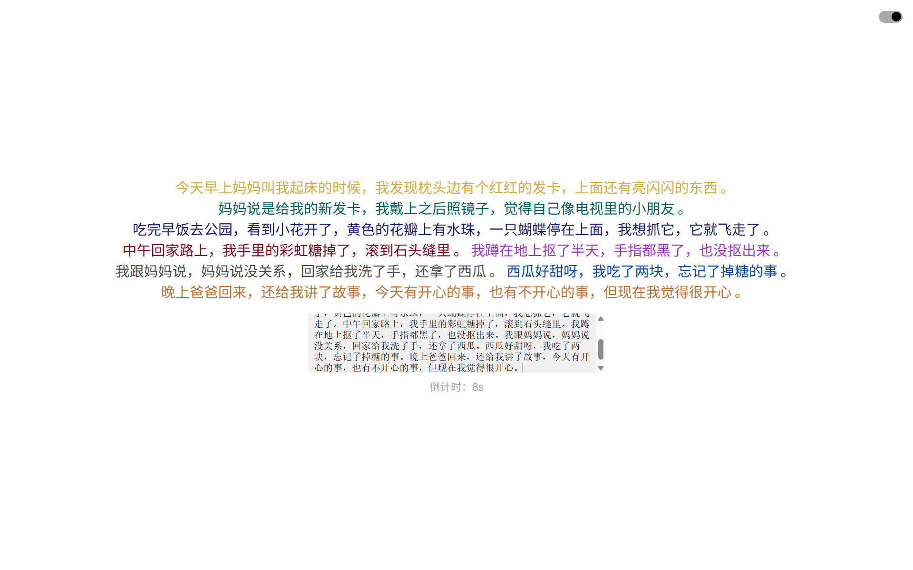
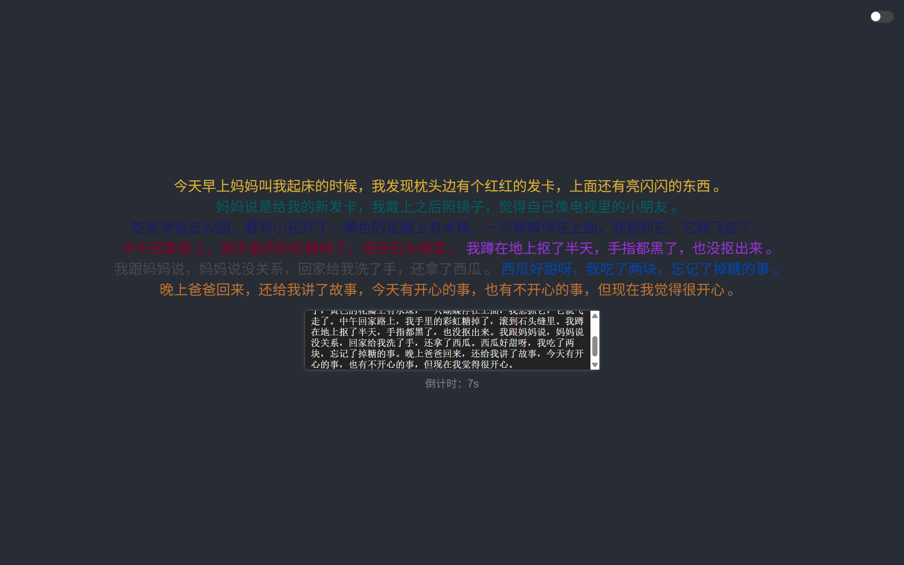

# 实时文字输入与展示界面
+ # Real-time Text Input and Display Interface

- 这是一个简单的 HTML 页面，实现了以下功能：
+ This is a simple HTML page that implements the following features:

- **实时文字输入**：用户可以在文本框中输入文字。
+ **Real-time Text Input**: Users can input text in a text box.
- **多彩文字展示**：根据预设的颜色数组，输入的文字会以不同的颜色展示。
+ **Colorful Text Display**: The entered text will be displayed in different colors according to a predefined color array.
- **倒计时清空**：如果用户停止输入超过 10 秒，输入框和展示区将自动清空，并显示倒计时提示。
+ **Countdown Clear**: If the user stops typing for more than 10 seconds, the input box and display area will automatically clear, showing a countdown prompt.

## 预览

## 使用方法

1. 点击 [这里](https://htmlpreview.github.io/?https://github.com/cong0928/LiveText-Display/blob/main/index.html)。
+ 1. Click [here](https://htmlpreview.github.io/?https://github.com/cong0928/LiveText-Display/blob/main/index.html).
2. 在文本框中输入文字（按回车可换行）。
+ 2. Enter text in the text box (press Enter to create a new line).
3. 等待 10 秒不输入，输入内容将自动清空。
+ 3. Wait for 10 seconds without entering any text, the input content will be cleared automatically.

## 依赖项

无需额外安装依赖，直接在浏览器中打开即可运行。
+ ## Dependencies
+
+ No additional dependencies are required. Just open it directly in your browser.
